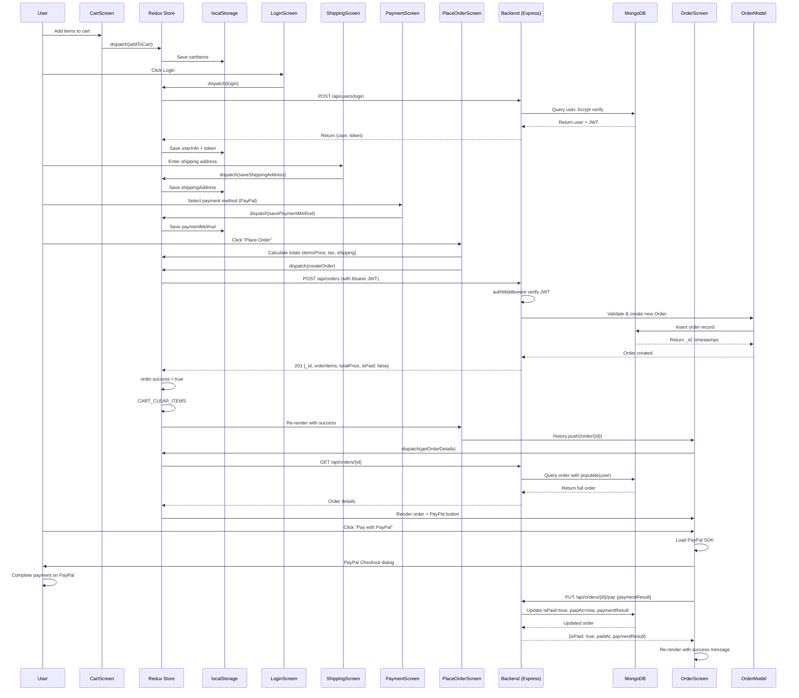

# ProShop MERN Architecture – C4 Container Diagram

## System Architecture Overview

```mermaid
C4Container
    title ProShop MERN – Architecture & Data Flow

    Person(user, "Customer")
    Person(admin, "Admin User")

    Container_Boundary(frontend, "Frontend Layer (React + Redux)") {
        Component(home, "HomeScreen\nfrontend/src/screens/HomeScreen.js", "React", "Product browsing")
        Component(product, "ProductScreen\nfrontend/src/screens/ProductScreen.js", "React", "Product details, reviews")
        Component(cart, "CartScreen\nfrontend/src/screens/CartScreen.js", "React", "Shopping cart")
        Component(login, "LoginScreen\nfrontend/src/screens/LoginScreen.js", "React", "User authentication")
        Component(register, "RegisterScreen\nfrontend/src/screens/RegisterScreen.js", "React", "User registration")
        Component(profile, "ProfileScreen\nfrontend/src/screens/ProfileScreen.js", "React", "User profile")
        Component(shipping, "ShippingScreen\nfrontend/src/screens/ShippingScreen.js", "React", "Shipping address")
        Component(payment, "PaymentScreen\nfrontend/src/screens/PaymentScreen.js", "React", "Payment method selection")
        Component(placeorder, "PlaceOrderScreen\nfrontend/src/screens/PlaceOrderScreen.js", "React", "Order confirmation")
        Component(order, "OrderScreen\nfrontend/src/screens/OrderScreen.js", "React", "Order details, PayPal")
        Component(userlist, "UserListScreen\nfrontend/src/screens/UserListScreen.js", "React", "Admin: users")
        Component(productlist, "ProductListScreen\nfrontend/src/screens/ProductListScreen.js", "React", "Admin: products")
        Component(orderlist, "OrderListScreen\nfrontend/src/screens/OrderListScreen.js", "React", "Admin: orders")
        
        Container(redux, "Redux Store\nfrontend/src/store.js", "Redux + Thunk", "Global state: cart, user, orders, products")
        Container(localstorage, "localStorage", "Browser Storage", "Persist: cartItems, userInfo, shippingAddress, paymentMethod")
    }

    Container_Boundary(backend, "Backend Layer (Express + Node.js)") {
        Component(server, "Express Server\nbackend/server.js", "Node.js ES Modules", "Entry point :5000")
        
        Component(productctrl, "productController\nbackend/controllers/productController.js", "Controller", "GET/POST/PUT/DELETE products, reviews, top products")
        Component(userctrl, "userController\nbackend/controllers/userController.js", "Controller", "Auth, registration, profile, admin users")
        Component(orderctrl, "orderController\nbackend/controllers/orderController.js", "Controller", "Create, get, update orders (pay, deliver)")
        
        Component(productroutes, "productRoutes\nbackend/routes/productRoutes.js", "Route", "/api/products*")
        Component(userroutes, "userRoutes\nbackend/routes/userRoutes.js", "Route", "/api/users*")
        Component(orderroutes, "orderRoutes\nbackend/routes/orderRoutes.js", "Route", "/api/orders*")
        Component(uploadroutes, "uploadRoutes\nbackend/routes/uploadRoutes.js", "Route", "/api/upload (multer)")
        
        Component(auth, "authMiddleware\nbackend/middleware/authMiddleware.js", "Middleware", "protect, admin – JWT verify")
        Component(error, "errorMiddleware\nbackend/middleware/errorMiddleware.js", "Middleware", "404, error handler")
        
        Component(jwtutil, "generateToken\nbackend/utils/generateToken.js", "Utility", "JWT sign (30 days)")
    }

    Container_Boundary(models, "Data Layer (MongoDB + Mongoose)") {
        Component(usermodel, "userModel\nbackend/models/userModel.js", "Mongoose Schema", "Users: name, email, password (bcrypt), isAdmin")
        Component(productmodel, "productModel\nbackend/models/productModel.js", "Mongoose Schema", "Products: name, image, price, reviews[], rating")
        Component(ordermodel, "orderModel\nbackend/models/orderModel.js", "Mongoose Schema", "Orders: orderItems[], shippingAddress, paymentResult, isPaid, isDelivered")
        
        Component(db, "MongoDB Connection\nbackend/config/db.js", "Mongoose", "MONGO_URI (localhost:27017/proshop)")
    }

    Container_Boundary(external, "External Services") {
        Component(paypal, "PayPal Sandbox API\nhttps://api.sandbox.paypal.com", "REST API", "Payment processing")
        Component(env, ".env Config\nPAYPAL_CLIENT_ID, JWT_SECRET, MONGO_URI", "Config", "Environment variables")
    }

    Rel(user, home, "Browse products")
    Rel(user, product, "View details")
    Rel(user, cart, "Add to cart")
    Rel(user, login, "Login/Register")
    Rel(user, shipping, "Enter address")
    Rel(user, payment, "Select PayPal")
    Rel(user, placeorder, "Place order")
    Rel(user, order, "Track, pay via PayPal")
    
    Rel(admin, userlist, "Manage users")
    Rel(admin, productlist, "Manage products")
    Rel(admin, orderlist, "Manage orders")

    Rel(home, redux, "dispatch: fetchProducts()")
    Rel(product, redux, "dispatch: fetchProduct(), createReview()")
    Rel(cart, redux, "dispatch: addToCart(), removeFromCart()")
    Rel(login, redux, "dispatch: login(), register()")
    Rel(shipping, redux, "dispatch: saveShippingAddress()")
    Rel(payment, redux, "dispatch: savePaymentMethod()")
    Rel(placeorder, redux, "dispatch: createOrder()")
    Rel(order, redux, "dispatch: getOrderDetails(), payOrder()")

    Rel(redux, localstorage, "Persist state")
    Rel(localstorage, redux, "Hydrate on init")

    Rel(redux, server, "HTTP Requests\n(Authorization: Bearer JWT)")
    
    Rel(server, productroutes, "Route requests")
    Rel(server, userroutes, "Route requests")
    Rel(server, orderroutes, "Route requests")
    Rel(server, uploadroutes, "Route requests")
    
    Rel(productroutes, productctrl, "Execute logic")
    Rel(userroutes, userctrl, "Execute logic")
    Rel(orderroutes, orderctrl, "Execute logic")
    
    Rel(productctrl, auth, "Verify admin")
    Rel(userctrl, auth, "Verify JWT, admin")
    Rel(orderctrl, auth, "Verify JWT")
    
    Rel(userctrl, jwtutil, "Generate token")
    
    Rel(productctrl, productmodel, "Query/Save")
    Rel(userctrl, usermodel, "Query/Save")
    Rel(orderctrl, ordermodel, "Query/Save")
    
    Rel(productmodel, db, "Mongoose")
    Rel(usermodel, db, "Mongoose")
    Rel(ordermodel, db, "Mongoose")
    
    Rel(order, paypal, "PayPal SDK + Checkout")
    Rel(order, server, "PUT /api/orders/:id/pay")
    
    Rel(server, env, "Read JWT_SECRET, PAYPAL_CLIENT_ID, MONGO_URI")
```



---

## Data Flow: "Place Order" Scenario



---

## Entry Points Summary

### Frontend Entry Points (React Screens)
| Screen | File | Route | Purpose |
|--------|------|-------|---------|
| HomeScreen | `frontend/src/screens/HomeScreen.js` | `/` | Product listing & search |
| ProductScreen | `frontend/src/screens/ProductScreen.js` | `/product/:id` | Product details & reviews |
| CartScreen | `frontend/src/screens/CartScreen.js` | `/cart/:id?` | Shopping cart management |
| LoginScreen | `frontend/src/screens/LoginScreen.js` | `/login` | User authentication |
| RegisterScreen | `frontend/src/screens/RegisterScreen.js` | `/register` | User registration |
| ProfileScreen | `frontend/src/screens/ProfileScreen.js` | `/profile` | User profile management |
| ShippingScreen | `frontend/src/screens/ShippingScreen.js` | `/shipping` | Shipping address input |
| PaymentScreen | `frontend/src/screens/PaymentScreen.js` | `/payment` | Payment method selection |
| **PlaceOrderScreen** | `frontend/src/screens/PlaceOrderScreen.js` | `/placeorder` | Order confirmation |
| **OrderScreen** | `frontend/src/screens/OrderScreen.js` | `/order/:id` | Order details & PayPal payment |
| UserListScreen | `frontend/src/screens/UserListScreen.js` | `/admin/userlist` | Admin: manage users |
| UserEditScreen | `frontend/src/screens/UserEditScreen.js` | `/admin/user/:id/edit` | Admin: edit user |
| ProductListScreen | `frontend/src/screens/ProductListScreen.js` | `/admin/productlist` | Admin: manage products |
| ProductEditScreen | `frontend/src/screens/ProductEditScreen.js` | `/admin/product/:id/edit` | Admin: edit product |
| OrderListScreen | `frontend/src/screens/OrderListScreen.js` | `/admin/orderlist` | Admin: manage orders |

### Backend Entry Points (Controllers)
| Controller | File | Endpoints |
|-----------|------|-----------|
| **orderController** | `backend/controllers/orderController.js` | `POST /api/orders`, `GET /api/orders/:id`, `PUT /api/orders/:id/pay`, `PUT /api/orders/:id/deliver` |
| userController | `backend/controllers/userController.js` | `POST /api/users`, `POST /api/users/login`, `GET /api/users/profile`, `PUT /api/users/profile` |
| productController | `backend/controllers/productController.js` | `GET /api/products`, `GET /api/products/:id`, `POST /api/products/:id/reviews`, `POST /api/products`, `PUT /api/products/:id`, `DELETE /api/products/:id` |
| (File Upload) | `backend/routes/uploadRoutes.js` | `POST /api/upload` (multer) |

---

## Database Models (MongoDB)

### User Collection
```json
{
  "_id": "ObjectId",
  "name": "John Doe",
  "email": "john@example.com",
  "password": "bcrypt_hash",
  "isAdmin": false,
  "createdAt": "ISO8601",
  "updatedAt": "ISO8601"
}
```

### Product Collection
```json
{
  "_id": "ObjectId",
  "user": "ObjectId (ref: User)",
  "name": "Product Name",
  "image": "/images/product.jpg",
  "brand": "Brand Name",
  "category": "Category",
  "description": "Description",
  "reviews": [
    {
      "name": "Reviewer",
      "rating": 5,
      "comment": "Great product!",
      "user": "ObjectId (ref: User)",
      "createdAt": "ISO8601"
    }
  ],
  "rating": 4.5,
  "numReviews": 10,
  "price": 99.99,
  "countInStock": 5,
  "createdAt": "ISO8601",
  "updatedAt": "ISO8601"
}
```

### Order Collection
```json
{
  "_id": "ObjectId",
  "user": "ObjectId (ref: User)",
  "orderItems": [
    {
      "name": "Product Name",
      "qty": 2,
      "image": "/images/product.jpg",
      "price": 99.99,
      "product": "ObjectId (ref: Product)"
    }
  ],
  "shippingAddress": {
    "address": "123 Main St",
    "city": "New York",
    "postalCode": "10001",
    "country": "USA"
  },
  "paymentMethod": "PayPal",
  "paymentResult": {
    "id": "paypal_id",
    "status": "COMPLETED",
    "update_time": "2024-01-01T12:00:00Z",
    "email_address": "buyer@paypal.com"
  },
  "taxPrice": 15.00,
  "shippingPrice": 10.00,
  "totalPrice": 124.99,
  "isPaid": false,
  "paidAt": null,
  "isDelivered": false,
  "deliveredAt": null,
  "createdAt": "ISO8601",
  "updatedAt": "ISO8601"
}
```

---

## External Services

### PayPal Sandbox API
- **Endpoint:** `https://api.sandbox.paypal.com`
- **Configuration:** `PAYPAL_CLIENT_ID` in `.env`
- **Usage in Frontend:** 
  - `OrderScreen.js` fetches Client ID from `GET /api/config/paypal`
  - Dynamically loads PayPal SDK
  - Displays PayPal checkout button
  - On successful payment, calls `PUT /api/orders/:id/pay` with `paymentResult`
- **Backend Integration:**
  - `orderController.updateOrderToPaid()` receives payment result
  - Updates order: `isPaid = true`, `paidAt = now()`, stores `paymentResult`

### MongoDB
- **Connection:** `backend/config/db.js`
- **Configuration:** `MONGO_URI` in `.env`
- **Collections:** users, products, orders (Mongoose v5)

### JWT Authentication
- **Secret:** `JWT_SECRET` in `.env`
- **Duration:** 30 days
- **Generation:** `backend/utils/generateToken.js`
- **Verification:** `backend/middleware/authMiddleware.js` (protect middleware)
- **Header:** `Authorization: Bearer <token>`

### File Upload (Multer)
- **Route:** `POST /api/upload`
- **Destination:** `uploads/` directory
- **Naming:** `fieldname-timestamp.ext`
- **Accepted Types:** jpg, jpeg, png
- **Usage:** Product image uploads in admin

---

## Redux State Structure (for "Place Order")

```javascript
{
  // Cart state (persisted in localStorage)
  cart: {
    cartItems: [
      { product, name, image, price, countInStock, qty }
    ],
    shippingAddress: {
      address, city, postalCode, country
    },
    paymentMethod: "PayPal",
    itemsPrice: 199.98,
    shippingPrice: 0,
    taxPrice: 29.997,
    totalPrice: 229.977
  },

  // User login state (persisted in localStorage)
  userLogin: {
    userInfo: {
      _id, name, email, isAdmin, token
    }
  },

  // Order creation (cleared after success)
  orderCreate: {
    loading: false,
    success: true,
    order: { _id, user, orderItems, shippingAddress, ... }
  },

  // Order details (populated after navigation to /order/:id)
  orderDetails: {
    loading: false,
    order: {
      _id, user, orderItems, shippingAddress,
      paymentMethod, paymentResult,
      isPaid, paidAt, isDelivered, deliveredAt,
      createdAt
    }
  },

  // Order payment (updated after PayPal callback)
  orderPay: {
    loading: false,
    success: true
  }
}
```

---

## Key Middleware & Utilities

### Authentication Middleware (`backend/middleware/authMiddleware.js`)
- **protect:** Verifies JWT token, attaches `req.user` to request
- **admin:** Checks `req.user.isAdmin`, must follow `protect`

### Error Middleware (`backend/middleware/errorMiddleware.js`)
- **notFound:** 404 handler for unmatched routes
- **errorHandler:** Catches errors from controllers, returns proper HTTP status

### JWT Utility (`backend/utils/generateToken.js`)
- Generates JWT token with user ID
- 30-day expiration
- Signed with `JWT_SECRET`

---

## Environment Variables (.env)

```
NODE_ENV=development
PORT=5000
MONGO_URI=mongodb://localhost:27017/proshop
JWT_SECRET=your_jwt_secret_key_here
PAYPAL_CLIENT_ID=your_paypal_sandbox_client_id_here
```

---

## API Endpoints Summary

### Product Routes (`/api/products`)
- `GET /api/products` – List all products (paginated)
- `POST /api/products` – Create product (admin only)
- `GET /api/products/top` – Get top 3 products by rating
- `GET /api/products/:id` – Get product by ID
- `PUT /api/products/:id` – Update product (admin only)
- `DELETE /api/products/:id` – Delete product (admin only)
- `POST /api/products/:id/reviews` – Add review (authenticated)

### User Routes (`/api/users`)
- `POST /api/users` – Register user
- `POST /api/users/login` – Authenticate user
- `GET /api/users` – List all users (admin only)
- `GET /api/users/profile` – Get authenticated user profile
- `PUT /api/users/profile` – Update user profile (authenticated)
- `GET /api/users/:id` – Get user by ID (admin only)
- `PUT /api/users/:id` – Update user (admin only)
- `DELETE /api/users/:id` – Delete user (admin only)

### Order Routes (`/api/orders`)
- `POST /api/orders` – Create order (authenticated)
- `GET /api/orders` – List all orders (admin only)
- `GET /api/orders/myorders` – Get authenticated user's orders
- `GET /api/orders/:id` – Get order by ID (authenticated)
- `PUT /api/orders/:id/pay` – Update order payment status (authenticated)
- `PUT /api/orders/:id/deliver` – Update delivery status (admin only)

### Upload Routes (`/api/upload`)
- `POST /api/upload` – Upload file (multer)

### Config Routes (`/api/config`)
- `GET /api/config/paypal` – Get PayPal Client ID (public)

---

## Technical Stack

| Layer | Technology | Details |
|-------|-----------|---------|
| **Frontend** | React 16.13 | No TypeScript, React Router v5, Bootstrap (vendored CSS) |
| **State Management** | Redux + Redux-Thunk | 20 slices, no Redux Toolkit |
| **Backend** | Express.js | Node.js ES modules, nodemon dev server |
| **Database** | MongoDB + Mongoose v5 | No migrations, schemas in models/ |
| **Authentication** | JWT | 30-day tokens, bcrypt for passwords |
| **File Upload** | Multer | jpg/jpeg/png only, saves to uploads/ |
| **HTTP Client** | fetch API | Via Redux thunks |
| **Payment** | PayPal Sandbox | Client-side SDK + backend webhook |
| **Logging** | morgan | HTTP request logging (dev mode only) |

